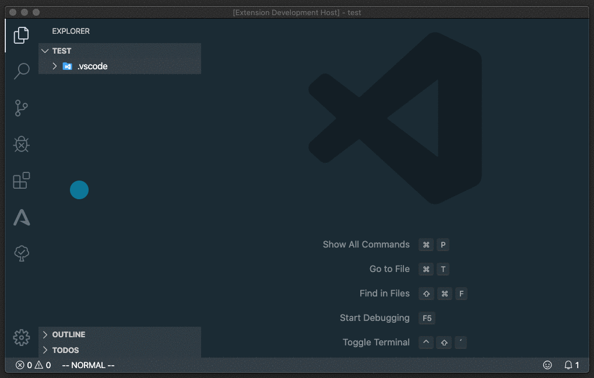

# Module Templates

A flexible VSCode extension for creating file/folder templates for new modules.

_There are no templates included with this extension_. This means that you'll have to do the hard work yourself, but it also means that you can use this with any language/framework that you want.



## Use

Use the plugin either by right clicking in the file explorer and selecting `New From Template` or by running `New From Template` using the command palette.

## Templates

Templates are defined in VS Code settings. If your code is shared by many people it can be nice to put templates in workspace settings (`.vscode/settings.json`) so that they can be used by everyone!

Below is a config example, showing how a template for a React component can be defined. The example template defines a folder, a `.jsx` file and a `.scss` file.

```json
{
  "module-templates.templates": [
    {
      "displayName": "React component",
      "defaultPath": "source/components",
      "folder": "{name.raw}",
      "files": [
        {
          "name": "{name.raw}.jsx",
          "content": [
            "import React from 'react';",
            "",
            "const {name.pascal} = () =>",
            "  <div className=\"{name.kebab}\" />",
            "",
            "export default {name.pascal};"
          ]
        },
        {
          "name": "{name.raw}.scss",
          "content": [".{name-kebab} {}"]
        }
      ]
    }
  ]
}
```

## Configuration API

### displayName

Required. This name is used when selecting a template to create from.

### defaultPath

Optional. A path relative to the workspace root. When running the extension from the command palette files will be output to this path. When running from the right-click menu this option has no effect.

### folder

Optional. If this is option is set, a folder is created using the name from the option. Supports replacement tokens (see below).

### files

Required. A list of file templates.

### file.name

Required. A name for the file to create (with file extension). Supports replacement tokens (see below).

### file.content

Required. The content of the file to create, given as an array of strings. Supports replacement tokens (see below).

## Replacement tokens

When creating a new module from a template, the extension will ask for a name for the new module. This name can be referenced in templates (in `folder`, `file.name` and `file.content`) with some different casing alternatives.

In the following example, a folder will be created using a PascalCase version of what was typed into the input box.

```json
{
  "folder": "{name.pascal}"
}
```

### List of tokens

- `{name.raw}`: Unmodified name from input box
- `{name.pascal}`: PascalCased name
- `{name.kebab}`: kebab-cased name
- `{name.camel}`: camelCased name
- `{name.snake}`: snake_cased name
